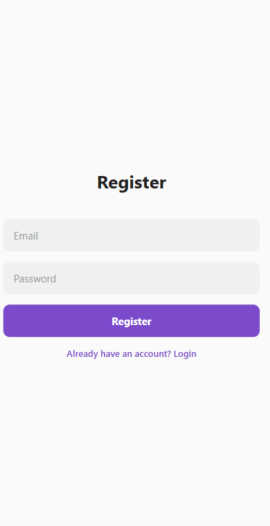
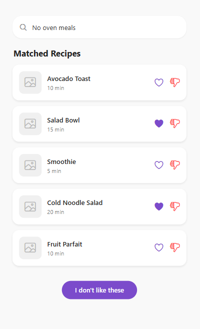
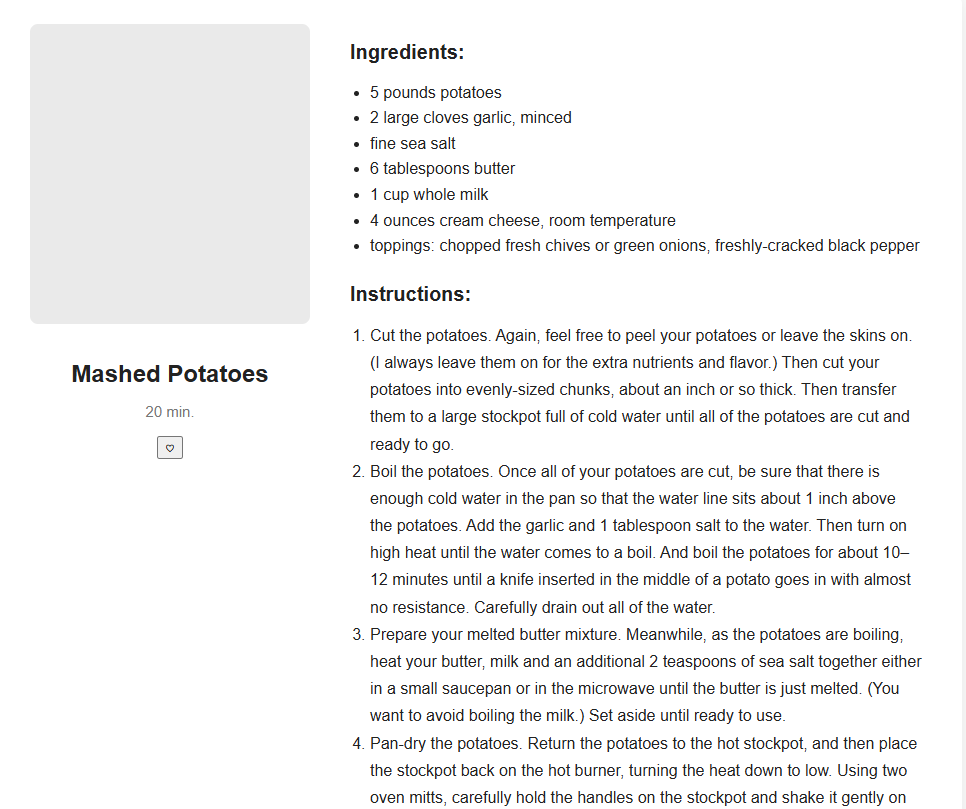
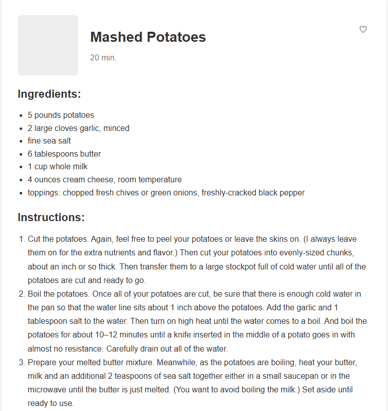

# Tech Challenge - Recipe App

## Description
This is a React Native application for managing and viewing recipes. Users can register, log in, view recipes, mark them as favorites, like or dislike recipes, and search recipes using an AI prompt. The app follows the Figma design: [Figma link](https://www.figma.com/design/wuHnFuYeOER9m6VOHGmkif/FS-RN-Tech-Challenge?node-id=0-1&p=f).

## Technologies Used

### Frontend
- React Native  
- TypeScript  
- React Navigation  
- Expo  
- AsyncStorage for local storage  
- Ionicons for icons  

### Backend (Optional)
- Node.js  
- Express  
- SQLite for database  
- REST API endpoints for authentication and recipes  

### Design
- Figma for UI/UX  

## Project Structure
- `RecipeFinder/` – React Native frontend code  
- `server/` – local API server (Node.js + Express + SQLite)  
- `assets/` – images and resources used in the app  

## Screenshots

### Login


### Register


### Home and Favorites


### Recipe Details 1


### Recipe Details 2


## How to Run the App

### Frontend
1. Clone the repository:  
```bash
git clone https://github.com/oanamariasilivastru/Tech-Challenge-Tapptitude.git
Navigate to the frontend folder:

cd RecipeFinder
Install dependencies:

npm install


Start the app:

npx expo start


Open the app on an emulator or a physical device using Expo Go.
